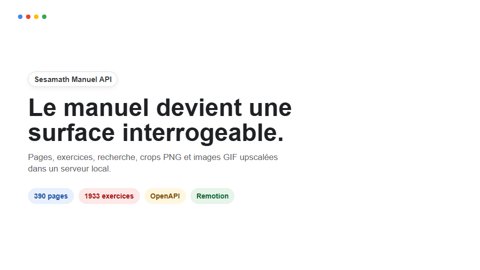
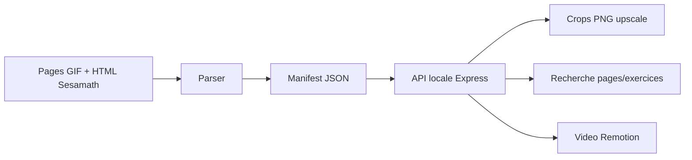
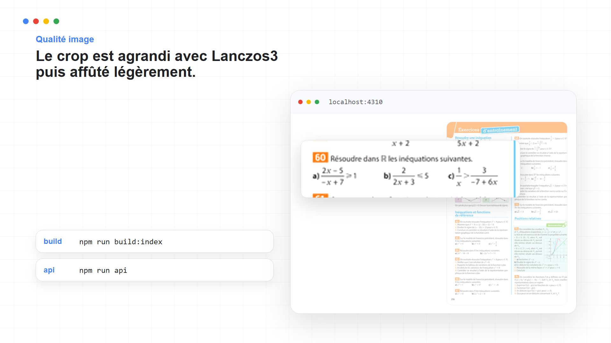

# Sesamath Manuel API

<p align="center">
  
</p>

<p align="center">
  <strong>Transformer un manuel numerique en API locale, explorable, cropable, reutilisable.</strong>
</p>

<p align="center">
  <a href="#demarrage-rapide">Demarrage</a>
  .
  <a href="#api">API</a>
  .
  <a href="#upscaler">Upscaler</a>
  .
  <a href="#video-remotion">Video Remotion</a>
  .
  <a href="#licences-et-attribution">Licences</a>
</p>

<p align="center">
  
  
  
  
  
</p>

---

## L'idee

Le manuel Sesamath n'est pas seulement une suite de pages GIF.

Chaque double-page contient aussi du HTML : des zones cliquables, des identifiants d'exercices, des rectangles, des liens vers les atomes du manuel. Ce repo transforme cette structure cachee en un objet programmable.



En clair : tu peux demander `exercice 60 page 256`, et l'API retrouve la bonne zone du manuel, la decoupe, l'agrandit proprement, puis la renvoie en PNG.

<p align="center">
  
</p>

## Ce que contient le repo

| Piece | Role |
| --- | --- |
| `src/api` | Serveur Express, routes JSON, OpenAPI minimal |
| `src/sesamath` | Constantes du manuel, parseur HTML, repository, crops, upscaler |
| `scripts/build-index.ts` | Telecharge les pages et construit le manifest local |
| `scripts/prepare-demo-assets.ts` | Prepare les crops et pages upscalees pour la video |
| `scripts/smoke-test.ts` | Test rapide du manifest et du crop |
| `src/video` | Composition Remotion style Google / Material |
| `public/demo` | Petits assets de demonstration derives du manuel |

## Demarrage rapide

```powershell
git clone https://github.com/zay168/sesamath-manuel-api.git
cd sesamath-manuel-api
npm install
```

Construire l'index complet du manuel :

```powershell
npm run build:index
```

Lancer l'API :

```powershell
npm run api
```

Ouvrir ensuite :

```text
http://localhost:4310
```

## Mode fonctions seulement

Pour reviser les chapitres de Seconde sur les fonctions sans tout telecharger :

```powershell
npm run build:index:functions
```

Ce mode indexe les pages `189` a `268`, c'est-a-dire :

| Chapitre | Pages | Theme |
| --- | ---: | --- |
| F8 | 189-216 | Generalites sur les fonctions |
| F9 | 217-240 | Variations et extremums |
| F10 | 241-268 | Signe d'une fonction et inequations |

## API

### Etat du serveur

```http
GET /health
```

Exemple de reponse :

```json
{
  "ok": true,
  "ouvrage": "ms2_2019",
  "pages": 390,
  "exercises": 1933
}
```

### Pages

```http
GET /api/pages
GET /api/pages?chapter=F10
GET /api/pages?from=256&to=259
GET /api/pages/256
GET /api/pages/256/image
GET /api/pages/256/upscaled-image?scale=2
```

### Exercices

```http
GET /api/exercises?page=256
GET /api/exercises?number=60
GET /api/exercises/60?page=256
GET /api/exercises/60/crop?page=256&scale=5
```

### Recherche

```http
GET /api/search?q=fonction
GET /api/openapi.json
```

## Upscaler

Le manuel numerique source fournit des pages GIF de petite taille. L'objectif n'est donc pas de "magiquement" recreer une page HD, mais d'obtenir un agrandissement lisible et stable.

La recette utilisee dans `src/sesamath/upscale.ts` :

1. resize avec `Lanczos3` ;
2. contraste tres leger ;
3. affutage faible ;
4. export PNG avec compression propre.

Ce choix evite l'effet pixelise de `nearest-neighbor`, tout en restant robuste sur des textes mathematiques, fractions, tableaux et signes.

```http
GET /api/exercises/60/crop?page=256&scale=5
```

Produit par exemple :

<p align="center">
  
</p>

## Video Remotion

Le repo contient une demo video programmee avec Remotion.

Preparer les assets :

```powershell
npm run prepare:video
```

Ouvrir le studio :

```powershell
npm run video:studio
```

Rendre une frame de controle :

```powershell
npm run video:still
```

Rendre la video :

```powershell
npm run video:render
```

La direction visuelle est volontairement Google / Material : fond blanc, cartes sobres, quatre couleurs d'accent, animation legere.

## Donnees generees

Le dossier `data/` est volontairement ignore par Git.

Raison : il contient le cache local telecharge depuis Sesamath, donc beaucoup de HTML et GIF regenerables. Le repo publie le moteur, pas un dump inutile.

Pour reconstruire exactement le cache :

```powershell
npm run build:index
```

Pour forcer un re-telechargement :

```powershell
npx tsx scripts/build-index.ts --force
```

## Verification

Commandes utilisees pendant le developpement :

```powershell
npm run lint
npm run smoke
npm run prepare:video
npm run video:still
npm run video:render
```

Dernier etat verifie localement :

| Verification | Etat |
| --- | --- |
| TypeScript + ESLint | OK |
| Smoke test manifest/crop | OK |
| API `/health` | OK |
| API crop PNG | OK |
| API page GIF upscalee | OK |
| Rendu Remotion | OK |

## Limites honnetes

- Le crop depend des rectangles HTML du manuel numerique.
- La qualite visuelle reste bornee par les GIF source.
- Pour une vraie haute definition, il faudrait rasteriser une source PDF propre ou utiliser des sources vectorielles quand elles existent.
- Le parseur est adapte a la structure HTML actuelle du manuel Sesamath `ms2_2019`.

## Feuille de route

- [ ] endpoint pour exporter une page + ses exercices en JSON pedagogique ;
- [ ] CLI `sesamath get ex 60 p256` ;
- [ ] mode OCR optionnel pour recuperer le texte brut des exercices ;
- [ ] frontend local de revision ;
- [ ] rendu PDF/HTML de fiches d'exercices ;
- [ ] extraction depuis PDF haute definition si disponible.

## Licences et attribution

Ce projet n'est pas affilie a Sesamath.

Sources utilisees :

- Manuel numerique : [manuel.sesamath.net](https://manuel.sesamath.net/)
- Exemple cible : [ms2_2019 page 256](https://manuel.sesamath.net/numerique/index.php?ouvrage=ms2_2019&page_gauche=256)
- Informations de licence Sesamath : [FAQ Sesamath](https://manuel.sesamath.net/index.php?page=faq)

D'apres la FAQ Sesamath, les manuels et cahiers sont sous double licence GNU FDL et CC-BY-SA, et les complements numeriques sont sous licence CC-BY-SA.

- Le code de ce depot est sous licence MIT.
- Les extraits, crops, pages et assets derives du manuel restent soumis aux licences de Sesamath et doivent conserver l'attribution requise.

## Structure mentale

Ce repo repose sur une idee simple :

> Une page de manuel est une image pour un humain, mais une structure indexable pour une machine.

Le but n'est pas seulement de telecharger un manuel.
Le but est de rendre ses objets manipulables : page, exercice, zone, crop, recherche, rendu.
